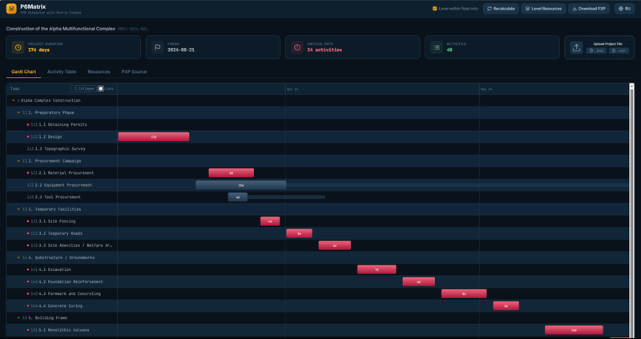
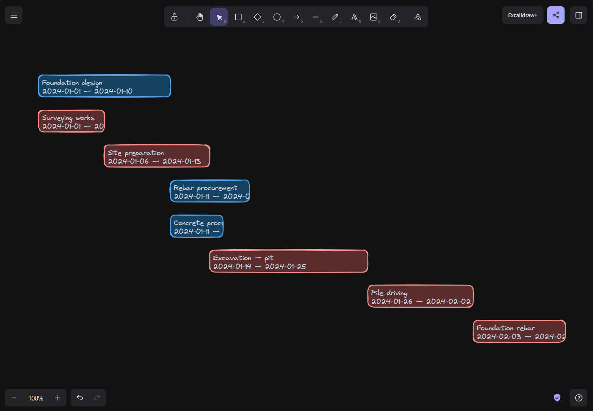
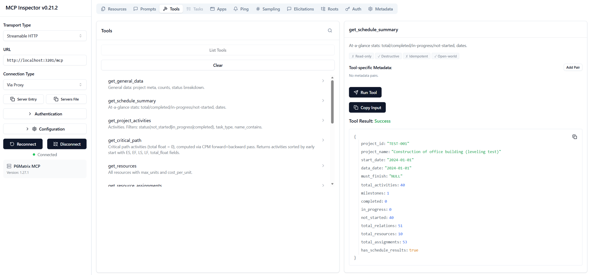

# P6Matrix - CPM Scheduler

Приложение для расчёта проектного расписания по методу критического пути (CPM) с матричным движком.
Использует WebGPU для расчётов на клиенте, что позволяет отображать весь проект целиком с минимальными задержками.

Application for project schedule calculation using the Critical Path Method (CPM) with a matrix engine.
Uses WebGPU for client-side calculations, allowing the entire project to be displayed with minimal delays



---

## Установка и запуск / Installation & Setup

### Требования / Requirements

| Компонент | Версия |
|-----------|--------|
| Python    | 3.10+  |
| Node.js   | 18+    |
| npm       | 9+     |

---

### 1. Бэкенд / Backend (FastAPI)

```bash
cd backend

# Создать виртуальное окружение / Create virtual environment
python3 -m venv .venv
source .venv/bin/activate # Linux/macOS
# или / or
.venv\Scripts\activate # Windows

pip install -r requirements.txt
uvicorn main:app --reload --host 0.0.0.0 --port 8000
uvicorn mcp_server:app --host 0.0.0.0 --port 3201
```

API будет доступен по адресу: **http://localhost:8000** / API available at

---

### 2. Фронтенд (React + Vite + Tailwind) / Frontend

```bash
cd frontend
npm install
npm run dev
```

Откройте браузер: **http://localhost:5173** / Open browser

---

### 3. Production

```bash
cd frontend
npm run build
```

---

## Использование / Usage

### Загрузка файла / File Upload

- Перетащите .pxp или .xer файл в зону загрузки / Drag and drop a .pxp or .xer file into the upload zone
- Или кликните для выбора через диалог / Or click to select via file dialog

### Форматы файлов / File Formats
| Формат | Описание |
|--------|----------|
| `.pxp` | Собственный формат P6Matrix (см. `pxp_format_spec.md`) |
| `.xer` | Экспорт из XER (конвертируется автоматически) |

### Интерфейс

| Вкладка | Описание |
|---------|----------|
| Диаграмма Ганта | Визуализация расписания с критическим путём, дерево WBS, свойства работ |
| Таблица работ | ES/EF/LS/LF, общий и свободный резерв для каждой работы |
| Ресурсы | Нагрузка ресурсов по дням, пики, перегрузки |
| PXP исходник | Текст файла (включая результат конвертации XER) |

### Взаимодействие с диаграммой Ганта

| Действие | Результат |
|----------|----------|
| Двойной щелчок по названию работы / Double-click on activity name | Прокрутка графика / Scroll chart |
| Двойной щелчок по шкале времени / Double-click on timeline | График полностью вписывается в экран / Chart fits entire screen |
| Однократный щелчок по названию работы / Single click on activity name | Таблица свойств работы под графиком / Activity properties table below chart |
| Ctrl + Клик по работе / Ctrl + Click on activity | Множественный выбор работ (подсветка оранжевым) / Multi-select activities (orange highlight) |
| Перетаскивание полосы / Drag bar | Сдвиг работы (установка ограничения ES) / Shift activity (set ES constraint) |
| Перетаскивание границы колонки / Drag column border | Изменение ширины колонки названий / Change name column width |
| Перетаскивание по шкале времени / Drag on timeline | Зум графика / Zoom chart |
| Перетаскивание внутри диаграммы, но не на работе / Drag inside diagram but not on activity | Перемещение графика / Pan chart |
| Перетаскивание работы на другую работу / Drag activity on activity | Создание связи FS / Create FS link |
- работы добавляются в таблице работ / activities are added in the Activity Table
- ресурсы добавляются и редактируются на закладке Ресурсы / resources are added and edited on the Resources tab

### Кнопки панели

| Кнопка | Действие |
|--------|----------|
| Пересчитать / Recalculate | Принудительный запуск CPM / Force CPM recalculation |
| Выровнять ресурсы / Level Resources | CPM + Эвристическое выравнивание ресурсов / Heuristic resource leveling |
| Скачать PXP / Download PXP | Сохранить текущий план в .pxp / Save current plan to .pxp |
| edraw | Экспорт выбранных работ в Excalidraw / Export selected activities to Excalidraw |
| MCP AI | Сохранить сессию для AI (MCP) / Share session for AI (MCP) |

### Галочка Только в пределах резерва / Level within float only Checkbox

При выравнивании ресурсов алгоритм ищет для каждой задачи наиболее ранний слот, в котором ресурс не перегружен. Галочка «Только в пределах резерва» ограничивает область поиска: задача может быть сдвинута не позже своего позднего начала (LS), то есть только в пределах имеющегося временного резерва (total float). Тогда общая дата окончания проекта не изменится, выравнивание происходит за счёт существующего резерва времени.
Если галочка снята, алгоритм может сдвигать задачи за пределы резерва, тогда проект может удлиниться, но перегрузки будут устранены более полно. Это имеет смысл когда перегрузка критична и важнее срока, или когда у большинства ресурсов нет достаточного резерва для выравнивания внутри него.
На практике: если после выравнивания с галочкой перегрузки остались, то это значит, что их невозможно устранить без сдвига критических работ. Снимите галочку, чтобы разрешить удлинение проекта ради снятия перегрузки.

When leveling resources, the algorithm searches for the earliest available slot where the resource is not overloaded. The "Level within float only" checkbox restricts the search window: a task can only be shifted up to its Late Start (LS), meaning it stays within its existing total float. This guarantees that the overall project finish date does not change - leveling happens using the time buffer already present in the schedule.
If the checkbox is unchecked, the algorithm is allowed to push tasks beyond their float - the project may finish later, but overloads will be resolved more completely. This makes sense when resource overloading is critical and more important than the deadline, or when most resources have insufficient float to level within it.
In practice: if overloads remain after leveling with the checkbox on, it means they cannot be resolved without shifting critical activities. Uncheck the box to allow the project to extend in exchange for eliminating the overload

---

## Экспорт в Excalidraw / Excalidraw Export

Позволяет создать скетч расписания для вставки в заметки или презентации.

Allows you to create a schedule sketch for inserting into notes or presentations.

1. Удерживайте `Ctrl` и кликните на работы на диаграмме Ганта. Они выделятся оранжевым контуром / Hold `Ctrl` and click on activities in the Gantt chart. They will be highlighted with an orange border
2. Нажмите кнопку **edraw** / Click the **edraw** button
3. Скачается файл `.excalidraw` / File `.excalidraw` will be downloaded



Работы (до 20 шт) превращаются в карточки с названием и датами / Activities (up to 20) turn into cards with names and dates

---

## Интеграция с AI (MCP) / AI Integration (MCP)

Интеграция с Claude и другими AI через Model Context Protocol.

Integration with Claude and other AI via Model Context Protocol.

```bash
cd ~
MCP_PROXY_AUTH_TOKEN=12345678AABBCCDD7164ab79d855946c458a2b940a57098aAABBCCDD12345678 npx @modelcontextprotocol/inspector
```

1. Нажмите кнопку **MCP AI** / Click the **MCP AI** button
2. Текущее расписание сохранится в `backend/shared.pxp` / The current schedule is saved to `backend/shared.pxp`
3. MCP-сервер (порт 3201) предоставит AI доступ к данным проекта / The MCP server (port 3201) will provide AI access to project data



**Доступные инструменты / Available Tools:**

*   `get_general_data`: Общие данные: мета проекта, количество работ, разбивка по статусам / General data: project meta, counts, status breakdown
*   `get_schedule_summary`: Сводка по проекту: даты, количество завершённых/в работе / At-a-glance stats: dates, completed/in-progress counts
*   `get_project_activities`: Список работ с фильтрами (статус, тип, название) / Activities list with filters (status, type, name)
*   `get_critical_path`: Критический путь (работы с TF=0) / Critical path activities (TF=0)
*   `get_resources`: Список ресурсов и их лимиты / Resources list and limits
*   `get_resource_assignments`: Назначения ресурсов на работы / Resource-activity assignments
*   `analyze_resource_utilization`: Анализ загрузки ресурсов (пики, перегрузки) / Resource utilization analysis (peaks, overloads)
*   `check_schedule_quality`: DCMA-проверки качества расписания (отсутствие связей, длинные работы) / DCMA-style schedule quality checks
*   `get_wbs`: Иерархическая структура работ (WBS) / Work Breakdown Structure
*   `get_relationships`: Связи между работами (предшественники/последователи) / Activity relationships (pred/succ)
*   `get_calendars`: Определения календарей (дни недели, часы) / Calendar definitions
*   `get_earned_value`: Показатели освоенного объёма (EVM): BAC, PV, EV, AC, CPI, SPI, EAC / Earned Value Management metrics
*   `get_activity_detail`: Детализация одной работы (поля, связи, назначения) / Detail for a single activity

---

## API Endpoints

```
GET  /              - health check
POST /upload        - загрузка файла (.pxp или .xer)
POST /schedule      - пересчёт из PXP-текста
POST /level         - расчёт + выравнивание ресурсов
```

Все endpoints открытые. CORS разрешён для любых источников (allow_origins=["*"]) / All endpoints are open. CORS allowed for any origin (allow_origins=["*"])

---

## Матричный CPM-алгоритм

Движок использует **тропическое (max-plus) матричное умножение** через numpy (CPU) или WebGPU (GPU).

### Матрицы N×N (где N = число работ)

```python
FS[i,j] = лаг  если есть Finish-to-Start связь i в j, иначе nan
SS[i,j] = лаг  Start-to-Start
FF[i,j] = лаг  Finish-to-Finish
SF[i,j] = лаг  Start-to-Finish
D[i]    = длительность работы i
```

### Прямой проход

```python
# FS: EF предшественника + лаг
EF_col = (ES + D).reshape(N, 1)
cand   = where(mask_FS, EF_col + FS, -inf)
ES     = maximum(ES, cand.max(axis=0))

# Аналогично для SS, FF, SF
```

### Обратный проход (транспонированный граф)

```python
LS_row = (LF - D).reshape(1, N)
cand   = where(mask_FS, LS_row - FS, +inf)
LF     = minimum(LF, cand.min(axis=1))
```

### Ускорение на Metal (Apple Silicon)

Заменить `numpy` на `torch` с `.to("mps")`:

```python
import torch
device = torch.device("mps")

FS_t = torch.tensor(FS, device=device)
ES_t = torch.tensor(ES, device=device)
D_t  = torch.tensor(D,  device=device)

EF_col = (ES_t + D_t).unsqueeze(1)
cand = torch.where(~torch.isnan(FS_t), EF_col + FS_t,
    torch.tensor(-1e15, device=device))
ES_new = cand.max(dim=0).values.clamp(min=0)
```

---

## Конвертация XER

Парсер XER обеспечивает максимальное покрытие таблиц XER. Все распознанные таблицы конвертируются в соответствующие секции PXP для двусторонней конвертации.

### Основные таблицы (ядро проекта)

| XER-таблица | PXP-секция | Описание |
|-------------|-----------|----------|
| `PROJECT` | `@META` | Метаданные проекта: имя, даты, единицы, автостатус, правила расчёта |
| `TASK` | `@ACTIVITIES` | Работы: все поля (тип, длительность, даты, прогресс, ограничения, WBS-привязка, UDF) |
| `TASKPRED` | `@RELATIONS` | Связи предшествования: FS/SS/FF/SF с лагами, проценты завершения |
| `RSRC` | `@RESOURCES` | Ресурсы: имя, тип, единицы, ставка, роль, кривая производительности |
| `TASKRSRC` | `@ASSIGNMENTS` | Назначения ресурсов: единицы, бюджет, фактические трудозатраты, кривая |

### Структура проекта (WBS)

| XER-таблица | PXP-секция | Описание |
|-------------|-----------|----------|
| `PROJWBS` | `@WBS` | Иерархическая структура работ: код, название, родитель |

### Календари

| XER-таблица | PXP-секция | Описание |
|-------------|-----------|----------|
| `CALENDAR` | `@CALENDARS` | Календари: рабочие/нерабочие периоды, исключения, стандартная неделя |
| `CALENDARTYPE` / `CLNDRTYPE` | `@CALENDARS` | Тип календаря (глобальный, проектный, персональный) |

### Роли

| XER-таблица | PXP-секция | Описание |
|-------------|-----------|----------|
| `ROLE` | `@ROLES` | Ресурсные роли: имя, ID |
| `TASKROLE` | `@ASSIGNMENTS` | Назначения ролей на работы |

### Коды работ (Activity Codes)

| XER-таблица | PXP-секция | Описание |
|-------------|-----------|----------|
| `ACTVTYPE` | `@ACTIVITY_CODES` | Определения типов кодов (название, длина, тип значения) |
| `ACTVCODE` | `@ACTIVITY_CODES` | Значения кодов |
| `TASKACTVCODE` | `@ACTIVITY_CODES` | Привязка кодов к работам |

### Пользовательские поля (UDF)

| XER-таблица | PXP-секция | Описание |
|-------------|-----------|----------|
| `UDFTYPE` | `@UDF_TYPES` | Определения UDF: тип данных, таблица-владелец, длина, предcomputable |
| `TASKUDF` | `@UDF_VALUES` | Значения UDF для работ (текстовые, числовые, датовые, кодированные) |
| `PROJUDF` | `@UDF_VALUES` | Значения UDF для проекта |

### Примечания

| XER-таблица | PXP-секция | Описание |
|-------------|-----------|----------|
| `TASKNOTE` | `@NOTES` | Примечания к работам (текст, тип) |
| `PROJNOTE` | `@NOTES` | Примечания к проекту |

### Шаги работ

| XER-таблица | PXP-секция | Описание |
|-------------|-----------|----------|
| `TASKSTEP` | `@STEPS` | Шаги внутри работ: название, вес, статус завершения |
| `TASKSTEPDEP` | `@STEPS` | Зависимости между шагами |

### Статьи расходов

| XER-таблица | PXP-секция | Описание |
|-------------|-----------|----------|
| `COST` | `@EXPENSES` | Статьи расходов: категория, сумма, дата, авторасчёт |

### Базовые планы

| XER-таблица | PXP-секция | Описание |
|-------------|-----------|----------|
| `BASETYPE` | `@BASELINES` | Определения типов базовых планов |
| `TASK` (поля `bl_*`) | `@BASELINES` | Базовые значения работ (длительность, даты, стоимость, трудозатраты) |

### Документы и вложения

| XER-таблица | PXP-секция | Описание |
|-------------|-----------|----------|
| `DOCTMPL` | (пропускаются) | Шаблоны документов |
| `PROJECTDOCS` | (пропускаются) | Привязки документов к проекту |
| `TASKDOC` | (пропускаются) | Привязки документов к работам |

### Проблемы и риски

| XER-таблица | PXP-секция | Описание |
|-------------|-----------|----------|
| `ISSUE` | (пропускаются) | Зарегистрированные проблемы |
| `RISK` | (пропускаются) | Риски проекта |

### Пороги и метрики

| XER-таблица | PXP-секция | Описание |
|-------------|-----------|----------|
| `THRESHOLD` | (пропускаются) | Пороговые значения |
| `THRESHOLDPARAM` | (пропускаются) | Параметры порогов |

### Ресурсные кривые и ставки

| XER-таблица | PXP-секция | Описание |
|-------------|-----------|----------|
| `RSRCCURVE` | `@RESOURCES` | Кривые распределения ресурса |
| `RSRCRATE` | `@RESOURCES` | Ставки ресурса (по типам расценок) |
| `OVERTIMERATE` | `@RESOURCES` | Ставки сверхурочных |

### Профили проекта

| XER-таблица | PXP-секция | Описание |
|-------------|-----------|----------|
| `PROFPKG` | (пропускаются) | Профильные пакеты |
| `PROJPROF` | (пропускаются) | Привязка профилей к проекту |

### Финансирование

| XER-таблица | PXP-секция | Описание |
|-------------|-----------|----------|
| `FUNDING` | (пропускаются) | Строки финансирования |
| `PROJFUND` | (пропускаются) | Привязка финансирования к проекту |

### Периодическая производительность

| XER-таблица | PXP-секция | Описание |
|-------------|-----------|----------|
| `PERIODPERF` | (пропускаются) | Данные по периодам для освоенного объёма |

### Расположения работ

| XER-таблица | PXP-секция | Описание |
|-------------|-----------|----------|
| `LOCA` | (пропускаются) | Местоположения (географические привязки) |

### Неизвестные таблицы

Любые таблицы XER, не перечисленные выше, пропускаются без ошибки. Все предупреждения отображаются в интерфейсе.

### Правила конвертации

- **Длительности**: XER хранит в часах в PXP в днях (8, настраивается через `hours_per_day` в `@META`)
- **Даты**: XER хранит как `YYYY-MM-DD HH:MM` в PXP как `YYYY-MM-DD`
- **Связи на отсутствующие работы**: пропускаются с предупреждением
- **Мультипроектность**: XER может содержать несколько проектов - каждый конвертируется в отдельный набор секций, разделённых маркером `@PROJECT_END` / `@PROJECT_BEGIN`
- **Полная двусторонняя конвертация**: PXP в XER восстанавливает все поддерживаемые таблицы с корректными внутренними ссылками (foreign keys)